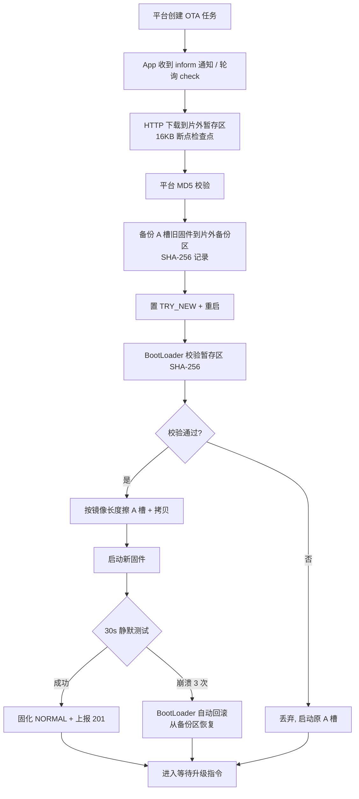

# STM32F407 OneNET OTA 远程升级系统

基于 **STM32F407VET6 + ESP-01S + W25Q16** 的云 OTA 远程升级演示工程，通过 **OneNET 云平台** 实现固件远程升级，带 **LVGL 图形界面**，完整支持双校验、断点续传、崩溃自动回滚、手动回滚与恢复出厂。

视频链接：https://www.bilibili.com/video/BV14zeW6YEJj/

## 功能特性

- **云 OTA 升级**：接入 OneNET 平台内置 OTA ，HTTP 下载升级包 + MQTT 订阅升级通知
- **双校验链**：平台 MD5（防传输损坏）+ 本机 SHA-256（BootLoader 启动前二次校验）
- **断点续传**：每 16KB 写入断点检查点，网络中断后自动从断点续传
- **三冗余区**：外部 Flash 划分暂存区 / 备份区 / 恢复区，升级、回滚、恢复出厂各有保障
- **崩溃自动回滚**：新固件连续 3 次启动失败，BootLoader 自动回滚到备份版本
- **手动回滚 / 恢复出厂**：About 页面按钮一键操作
- **参数区掉电安全**：32 槽位轮转写入（magic + seq + CRC32），写满才整扇区擦除，断电不损坏
- **版本防降级**：拒绝升级到低于当前版本的固件
- **30s 静默测试窗口**：新固件启动后 30s 内不执行任何升级动作，正常运行满窗口才固化
- **看门狗保护**：IWDG（8.19s 超时）全流程喂狗，升级/回滚/恢复期间不会误复位
- **LVGL 图形界面**：环形进度 + 实时状态 + 设备信息页（版本 / 分区 / 备份状态 / 启动计数）

## 硬件清单

| 部件 | 型号 | 说明 |
|---|---|---|
| MCU | STM32F407VET6 | 512KB Flash / 168MHz |
| 网络模组 | ESP-01S（ESP8266） | USART3 @ 57600bps |
| 外部 Flash | W25Q16（2MB） | SPI3：SCK=PB3, MISO=PB4, MOSI=PB5, CS=PA15 |
| 屏幕 | ILI9341 2.8 寸（MSP2807） | SPI 接口 |
| 触摸 | XPT2046 | SPI 接口 |
| 调试串口 | USART1 | 115200bps，`USART1_Printf` 输出 |
| 看门狗 | IWDG | Prescaler=64 / Reload=4095 → 约 8.19s |

## 系统架构

双工程结构：**BootLoader + App**，共用 `Shared` 源码层（分区定义、Flash 驱动、参数区、SHA-256、CRC32）。

```
┌─────────────────────── STM32F407 片内 Flash (512KB) ───────────────────────┐
│ BootLoader 48KB │ 参数区 16KB │ App A 槽 448KB                              │
│ S0-S2 @0x08000000│ S3 @0x0800C000 │ S4-S7 @0x08010000                      │
└────────────────────────────────────────────────────────────────────────────┘
┌─────────────────────── 外部 W25Q16 (2MB) ──────────────────────────────────┐
│ 暂存区 448KB │ 备份区 448KB │ 恢复区 448KB │ 资源区 ~704KB                  │
│ @0x000000    │ @0x070000   │ @0x0E0000   │ @0x150000                       │
└────────────────────────────────────────────────────────────────────────────┘
```

### 分区布局

| 区域 | 地址 | 大小 | 用途 |
|---|---|---|---|
| BootLoader | 0x08000000 | 48KB | 启动引导、升级/回滚/恢复执行 |
| 参数区 | 0x0800C000 | 16KB | 启动标志、版本、SHA、断点等（32 槽 × 512B 轮转） |
| App A 槽 | 0x08010000 | 448KB | 应用运行槽（LVGL + OTA 任务） |
| 暂存区（片外） | 0x00000000 | 448KB | 新固件下载缓冲 |
| 备份区（片外） | 0x00070000 | 448KB | 旧版本备份 |
| 恢复区（片外） | 0x000E0000 | 448KB | 出厂固件 |
| 资源区（片外） | 0x00150000 | ~704KB | 预留 |

### 启动标志

| 标志 | 含义 | 触发 |
|---|---|---|
| NORMAL (0) | 正常启动 | 固化成功 |
| TRY_NEW (1) | 尝试启动新固件 | 升级完成重启 |
| ROLLBACK (2) | 回滚到备份版本 | 手动回滚 / 崩溃计数 ≥3 |
| RECOVERY (3) | 恢复出厂 | A 槽损坏 / 手动恢复 |

## 升级 / 回滚 / 恢复流程



**回滚**：BootLoader 校验备份区 SHA-256 → 从备份区拷贝 → 启动旧版本。

**恢复出厂**：A 槽完全损坏（向量表无效）或手动触发 → BootLoader 校验恢复区 SHA-256 → 从恢复区拷贝 → 启动出厂固件。

## 校验与容错机制

| 机制 | 位置 | 作用 |
|---|---|---|
| MD5 | App 下载完成 | 与平台下发的 MD5 比对，防传输损坏 |
| SHA-256 | App 下载/备份/初始化时计算 · BootLoader 升级/回滚/恢复前校验 | 暂存区、备份区、恢复区三路哈希，防篡改 / 防半写坏包 |
| CRC32 | 参数区槽位 | 槽位数据有效性校验 |
| 启动计数 | BootLoader | TRY_NEW 期间每启动 +1，≥3 自动回滚 |
| 版本防降级 | App check 阶段 | 拒绝低于当前版本的升级任务 |
| 30s 静默窗口 | App 启动 | 新固件稳定运行满窗口才固化成功标志 |

## 界面展示（LVGL）

||
|


## 目录结构

```
.
├── App/                          # 应用工程（LVGL + OTA 任务）
│   ├── Core/
│   │   ├── Hardware/             # LCD / 触摸 / user_task（FreeRTOS 任务）
│   │   ├── ota/                  # esp01s / http_client / mqtt_client / md5 / ota 状态机
│   │   ├── Inc/ Src/             # CubeMX 生成（SPI / USART / IWDG / DMA / TIM）
│   │   └── ota/ota_config.h      # 平台 / WiFi / 版本配置
│   ├── Middlewares/LVGL/         # LVGL + GUI_APP/my_demos/ota_ui.c（界面）
│   └── MDK-ARM/                  # Keil 工程
├── BootLoader/                   # 引导工程
│   ├── boot/                     # boot_start.c（主流程）/ app_jump.c
│   ├── Core/                     # CubeMX 生成
│   └── MDK-ARM/                  # Keil 工程
└── Shared/                       # 双工程共用
    ├── partition.h               # 分区布局
    ├── ota_params.h              # 参数区结构体
    ├── param_area.c              # 32 槽轮转读写
    ├── flash_if.c                # 片内 Flash 擦写
    ├── w25q16.c                  # 片外 Flash 驱动
    ├── sha256.c / crc32.c        # 哈希 / 校验
    └── app_jump.h                # 跳转约定
```

## 快速开始

### 1. 编译烧录

1. 用 **Keil MDK-ARM** 分别打开 `BootLoader/MDK-ARM/BootLoader.uvprojx` 与 `App/MDK-ARM/project.uvprojx`；
2. 先编译 BootLoader 并烧录到片内 Flash（0x08000000）；
3. 再编译 App，通过 **ST-LINK / J-Link 烧录**（App 链接地址已固定 0x08010000），或经调试器下载后由 BootLoader 引导；
4. 首次上电 App 会自动把当前固件固化到外部 Flash 恢复区，作为出厂固件。

### 2. 平台侧配置（OneNET）

1. 创建产品与设备，记录 **产品 ID / 设备名称 / 设备密钥**；
2. 按 OneNET 规则生成 MQTT 接入 token，填入 `App/Core/ota/ota_config.h` 的 `OTA_MQTT_USER / OTA_MQTT_PASS / OTA_DEVICE_ID`；
3. 平台开通「增值服务 → OTA 升级」，上传 bin 固件升级包（版本号需与 `OTA_APP_VERSION_STR` 一致）；
4. 创建设备升级任务，设备侧 MQTT 通知或轮询即可感知。


### 3. 发布新固件

1. 修改 `ota_config.h`：`OTA_APP_VERSION_NUM` 与 `OTA_APP_VERSION_STR` 同步升版本号（防降级判断依赖该编码）；
2. 重新编译 App，将升级包上传平台并配置目标版本；
3. 平台推送任务，设备自动完成「下载 → 校验 → 备份 → 重启 → 试运行确认」。

---

